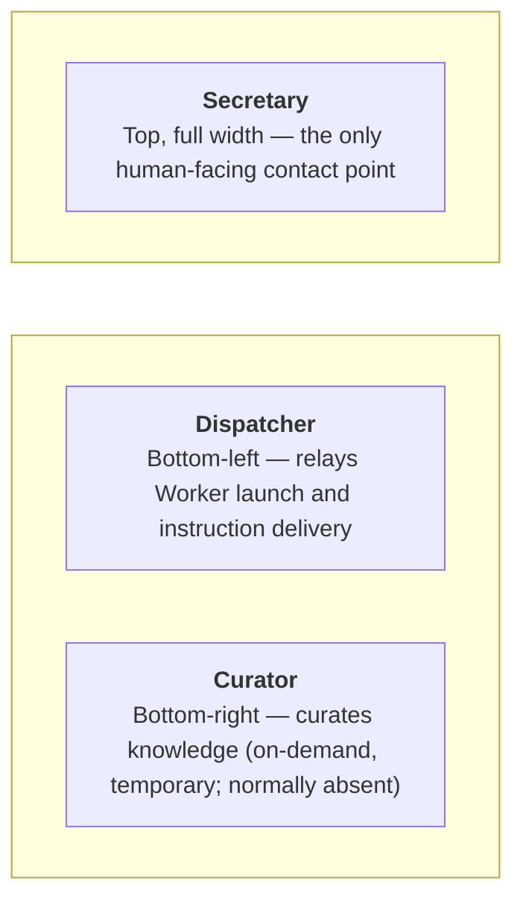

# claude-org

[](LICENSE)
[](https://github.com/suisya-systems/claude-org/actions/workflows/tests.yml)
[](#quick-start)

> **claude-org is the English-edition reference distribution.**
> Japanese edition: [suisya-systems/claude-org-ja](https://github.com/suisya-systems/claude-org-ja) (a dual Japanese/English repository setup. See [`docs/sync-policy.md`](docs/sync-policy.md) for synchronization rules).

---

## Why claude-org

claude-org is an operations layer for running Claude Code over long stretches in a "one Secretary + many Workers" configuration. Its differentiation rests on the following three pillars.

### First pillar: Billing-neutral design — keep running inside your fixed-plan quota

All agents (Secretary, Dispatcher, Curator, Worker) run as **interactive TUI sessions** and use no headless execution such as `claude -p` or the Agent SDK. Beginning 2026-06-15, headless usage is separated from the interactive quota and moved to metered billing (Agent SDK monthly credits + API charges for overage)[^billing], but this system is unaffected and **keeps running inside the fixed-plan quota**. That is the biggest difference from agent farm / loop configurations that presuppose headless execution.

In the opt-in broker transport ([see below](#four-layer-architecture-summary)), spawn-time argv allowlists are default-deny and pass only the flags required for an interactive TUI, **structurally rejecting headless launches**; an attestation procedure is also provided to inspect actual argv of running processes with `ps` ([`docs/operations/broker-dogfood-runbook.md` §6](docs/operations/broker-dogfood-runbook.md)). Even on the default renga path, Workers are always spawned as interactive TUIs and never receive headless flags.

### Second pillar: A reference implementation of Loop Engineering

This system implements all six elements of Loop Engineering[^loop] — the practice of designing "the very loop that keeps agents running" — in full.

| Element | Implementation in this system |
|---|---|
| **Trigger** (what kicks off a turn) | peer message receipt (renga = in-band push / broker = nudge + `check_messages` pull) / next-dispatch after PR merge / the Dispatcher's periodic monitoring |
| **Context** (context supply) | `CLAUDE.md` baseline + `.state/` + handover/resume |
| **Action** (execution) | Worker implementation work within the working-directory boundary |
| **Verification** | tests / lint / type checks + CI monitoring + human gates (optional Codex self-review when `codex` is available) |
| **Memory** | A refinement pipeline from raw learnings to organized knowledge (Curator) |
| **Escalation** | Human aggregation of decision requests + the pending-decisions register |

Beyond the original catalog, it also provides **loop liveness monitoring** (detection of silent stops and relay gaps), a **handover mechanism** (handover → resume when context grows large), and **throttled operation of human gates** (proactive notification of pending approvals plus register tracking).

### Third pillar: Humans supply only judgment

The human talks to only one Claude — the Secretary. The Secretary owns decisions about launches, instructions, and distribution, and the human is reduced to "returning judgment when called back." Inferred judgment on behalf of the human is prohibited: Worker decision requests, scope expansions, and blockers are never first-pass approved by the Secretary and are always escalated to a human, with the pending-decisions register preventing drops.

One of the mechanisms that supports this third pillar is the attention layer. It proactively notifies you of moments that need a human response — approval blocked / CI failed / awaiting decision / silent stop / PR merged — via OS notification + sound + terminal bell fallback, freeing you from continuously babysitting multiple Workers ([`docs/operations/attention-watch.md`](docs/operations/attention-watch.md)).

Safety mechanisms including sandbox mode and pre-hooks are automatically applied to every task without requiring special configuration from the human. This is especially effective when running multiple projects in parallel, and makes it relatively safe to operate `auto` mode or `bypass permissions` (by instructing the Secretary in advance, you can also grant additional permissions on top of the standard defensive defaults).

[^billing]: Sources: code.claude.com/docs/en/headless, support.claude.com article 15036540.
[^loop]: For the Loop Engineering framing, see <https://aimanavo.com/c/morphox_ai/a/7YDI1wUoI824pw> and <https://note.com/make_a_change/n/nd34f79a935b7>.

---

## Glossary

Minimal definitions of frequently used role names and related tools in this repository. Each linked document is the primary source.

| Term | Meaning | Primary source |
|---|---|---|
| **Secretary** | The only Claude instance that serves as the human-facing contact point. It is responsible only for task breakdown, delegation decisions, and communicating results; it does not perform implementation work itself. | [`CLAUDE.md`](CLAUDE.md) |
| **Dispatcher** | A proxy role that receives instructions from the Secretary, launches Worker panes, and hands off work briefs. Minimizes the time the Secretary is blocked. | [`.dispatcher/CLAUDE.md`](.dispatcher/CLAUDE.md) |
| **Curator** | An on-demand role that turns raw learnings accumulated in `knowledge/raw/` into organized knowledge. Launched temporarily at a worker close where the learnings exceed a threshold, and automatically closed after curation completes. | [`.curator/CLAUDE.md`](.curator/CLAUDE.md) |
| **Worker** | The implementation role launched per task. Handles everything from code edits through commit within a dedicated working-directory boundary (`git push` / pull request creation remain the Secretary's responsibility; Workers do not have permission to create PRs). | [`.claude/skills/org-delegate/SKILL.md`](.claude/skills/org-delegate/SKILL.md) |
| **renga** | The default transport (Layer 3) terminal multiplexer + `renga-peers` MCP server. Provides pane control and P2P messaging between panes (can be opt-in swapped for the runtime-bundled `broker`; both transports coexist and a rollback is always available). | [suisya-systems/renga](https://github.com/suisya-systems/renga) |

> **See also**: `renga` is a rename from its former name `ccmux` (`renga (formerly ccmux)`). Supplementary note for readers searching by the historical name. See [`docs/operations/m3-migration-runbook.md`](docs/operations/m3-migration-runbook.md) for the rename history.

---

## 30-Second Pitch

**Problem**: You want to run Claude Code for long stretches in a "one Secretary + many Workers" setup. Official features such as Agent View solve **visualization** of multiple instances, but the **work humans have to do by hand** — deciding who to launch, where to dispatch what, maintaining permission boundaries, accumulating learnings, restoring state — does not shrink. Naive tmux-style splitting and farm-style fully-automated parallelism likewise leave out operational discipline (permission boundaries, per-task environment setup, organized learnings).

**Solution**: claude-org is an **operational-discipline framework** dedicated to Claude Code (a reference implementation of Loop Engineering). By talking to a single Secretary Claude, Dispatcher, Curator, and Worker roles are derived automatically behind the scenes, and it **enforces from the start** narrow permission entries (narrow allowlist) + per-task working-directory boundaries + automatic knowledge curation once enough learnings accumulate + suspend/resume of state.

**Target users**: Developers and operators who want to run Claude Code in real work over long sessions, especially those who want explicit permission boundaries instead of full automation, want to run 3 to 5 Workers with a quality-first stance, and want to drive a self-improving knowledge loop.

---

## Four-Layer Architecture (summary)

claude-org is a reference distribution positioned at **Layer 4** of a four-layer stack. **Layer 3 is a swappable transport**: the default is `renga`, and as opt-in you can pick the runtime-bundled `broker` (pane control and messaging can now also be handled at Layer 2 = `claude-org-runtime`). Layer 2 further depends on Layer 1 (`core-harness`). Layers 1–3 have all been published as independent OSS packages; claude-org (Layer 4) is a thin shim that consumes them.

> **Transport runs in dual tracks (default renga / opt-in broker)**: The default transport remains **renga**. The runtime-bundled **broker** (`org-broker`) can be opted into with `ORG_TRANSPORT=broker` and is currently in dogfood phase. The default renga is always active as an opt-in fallback and a rollback is always available. For broker startup, lifecycle, billing-neutral attestation, and rollback procedures, see [`docs/operations/broker-dogfood-runbook.md`](docs/operations/broker-dogfood-runbook.md).

For each layer's responsibilities, mermaid diagrams, and package details, see [`docs/overview-technical.md`](docs/overview-technical.md).

---

## Quick Start

### One-liner (recommended)

If the prerequisite tools (`git` / `claude` / `renga` / `gh` / `jq` / Node.js / Python — see [`docs/getting-started.md`](docs/getting-started.md#prerequisites) for the minimum-version table) are already installed, you can run clone + `renga mcp install` in one shot with the following one-liner.

**macOS / Linux (bash)**:

```bash
curl -fsSL https://raw.githubusercontent.com/suisya-systems/claude-org/main/scripts/install.sh | bash
```

**Windows (PowerShell 7+)**:

```powershell
iwr -useb https://raw.githubusercontent.com/suisya-systems/claude-org/main/scripts/install.ps1 | iex
```

The script checks whether the prerequisite commands are installed, and if anything is missing it **shows installation instructions and exits** (it does not auto-install anything). After it finishes, launch with the following steps:

```bash
cd claude-org
source .venv/bin/activate                                # Linux / macOS only. Not needed on Windows native because scripts/install.ps1 uses the pip install --user path
bash scripts/install-hooks.sh                            # Enable the secret scanner that runs right before commit
python tools/org_setup_prune.py --user-common-sandbox    # Required once after pulling main (Issue #429 Task B/C + Issue #433 denyWrite)
renga --layout ops                                       # Launch the Secretary pane
```

> **⏱ Note on first-launch time**: Right after the initial clone, `renga --layout ops` + running `/org-setup` in the Secretary takes **several to over ten minutes longer** than a normal startup. Behind the scenes, `pip install -e .` (fetching `core-harness` / `claude-org-runtime`), `renga mcp install` (registering the MCP server), and sandbox reinforcement + PreToolUse hook deployment + generation of role-specific `settings.local.json` by `/org-setup` all run. From the second launch onward, expect about **1–2 minutes** as well (because `renga --layout ops` startup + Claude / MCP connection in each pane + `.state/` restore + automatic launch of the Dispatcher runs every time).

For pinning a specific version (`CLAUDE_ORG_REF`), the manual steps, and details on `pip install -e .` / `/org-setup` / `/org-start`, see [`docs/getting-started.md`](docs/getting-started.md).

---

## Why use this (comparison with existing tools)

| Compared with | Positioning | How it differs from claude-org |
|---|---|---|
| **Claude Code Agent View (official)** | A **visualization feature for surveying multiple Claude Code instances on a single screen**. Choosing where to direct work is still the human's job | claude-org **moves the coordination role (decisions about launching, instructing, and distributing) to the Secretary AI**. Running `/remote-connect` in the Secretary also lets you operate the system from Claude apps on Web / mobile / desktop |
| **Headless agent loops (`claude -p` / Agent SDK farm)** | Configurations that run agents at scale in parallel and on automated loops via headless execution | claude-org runs **every agent as an interactive TUI**, does not adopt headless metered billing, and **keeps running inside your fixed-plan quota** (billing-neutral; for the 2026-06-15 billing split, see the first pillar) |
| **Claude Code Subagents / Agent Teams (official)** | Anthropic's official "lead / teammate" hierarchy + automatic memory + hooks | claude-org is an operations layer on top of the official offering. It **coexists rather than competes**. It adds what the official offering does not provide: "enforced per-task working-directory boundaries," "schema-driven config drift detection," "a refinement pipeline from raw learnings to organized knowledge," and "threshold-driven on-demand automatic curation" |
| **Claude-based coordination platforms such as ccswarm / Ruflo / oh-my-claudecode** | Fixed role pool + oriented toward large-scale parallelism | claude-org **generates the working directory and `CLAUDE.md` fresh for each task** (it does not keep a prebuilt role pool). It is quality-first with 3 to 5 Workers (the opposite direction from farm-style systems) |
| **tmux / zellij + manual prompt splitting** | General-purpose terminal multiplexers + human-operated pane management | claude-org provides **P2P messaging between panes + structured pane creation + suspend/resume of state** through a dedicated MCP server (`renga-peers`). Its core value is what manual operation lacks: "role contracts," "automatic knowledge curation," and "role-specific permission distribution" |

→ For a more detailed 16-axis comparison (including CrewAI / LangGraph / AutoGen / Agent Zero / OpenSpace, etc.), see [`docs/oss-comparison.md`](docs/oss-comparison.md).

---

## How it works

```
Human <-> Secretary Claude (command role)
              |
              +-> Dispatcher (launches Workers and relays instructions)
              +-> Curator (curates knowledge, launched on demand and temporarily once learnings accumulate)
              +-> Worker pool (implementation work, automatically disappears after completion)
```

**Pane layout (right after `/org-start` — see the [Glossary](#glossary) for details on each role)**:



<table>
  <tr>
    <td width="50%"></td>
    <td width="50%"></td>
  </tr>
  <tr>
    <td><em>Just started: right after running <code>/org-start</code>. Secretary and Dispatcher have come up; no Worker exists yet (the screenshot dates from the resident-curator era; the Curator is now launched on demand and does not exist at this point).</em></td>
    <td><em>In action with workers: the Dispatcher has derived parallel Workers via task delegation, and the four-role configuration is running.</em></td>
  </tr>
</table>

- **Secretary**: The only human-facing contact point. Handles task breakdown, delegation decisions, and result reporting. Operational responsibilities are split internally into three skills ([`/org-delegate`](.claude/skills/org-delegate/SKILL.md) / [`/org-escalation`](.claude/skills/org-escalation/SKILL.md) / [`/org-pull-request`](.claude/skills/org-pull-request/SKILL.md)). When the Secretary session's context grows long, dump state with [`/secretary-handover`](.claude/skills/secretary-handover/SKILL.md), then recover with [`/secretary-resume`](.claude/skills/secretary-resume/SKILL.md) after `/clear` (refreshing only the Secretary while leaving the Dispatcher / Worker panes alive)
- **Dispatcher**: Relays pane launches and instruction delivery, minimizing the time the Secretary is blocked
- **Curator**: Launched on demand by the Dispatcher at a worker close where accumulated raw learnings exceed a threshold. Runs the refinement into organized knowledge and skill / process improvement proposals once, then is automatically closed
- **Worker**: Handles implementation work. Within the per-task working-directory boundary, it autonomously works through commit (pull request creation stays on the Secretary side), and records raw learnings after completion

All panes run within the same tab (`new_tab`, which opens a separate tab, is not used in organizational operations).

---

## Features intentionally not included (summary)

To actively state the design philosophy of claude-org, here are **five intentional non-features**:

1. **It does not distribute `--dangerously-skip-permissions` to Workers by default** — narrow permission entries + defense in depth are a core value. It does not universally hand out full permission-boundary bypass to implementation roles (only the Dispatcher adopts `bypassPermissions` as a necessary compromise for Sonnet operations; see [`docs/non-goals.md`](docs/non-goals.md) §1)
2. **It does not keep a fixed role pool (frontend / backend / QA agents)** — it generates a working directory and `CLAUDE.md` fresh for each task. A prebuilt role pool conflicts with per-task discipline
3. **It does not do large-scale parallelism (20+ agents)** — it assumes 3 to 5 Workers. Quality-first, the opposite direction from farm-style systems
4. **It does not generate project scaffolds from natural language (auto-create app)** — this is an operational-discipline framework, not a scaffold generator
5. **It does not switch among multiple providers (Aider / Codex / Gemini, etc.)** — Claude-only. `codex` is assumed only for optional review use

For details, the remaining seven items (PTY layer / cross-`--add-dir` / HTTP exposure of MCP, etc.), why they are excluded, and what alternatives exist, see [`docs/non-goals.md`](docs/non-goals.md).

---

## Skill list

Skills are divided into three groups by prefix. `/org-*` are for operating the organizational runtime (daily operations that directly handle panes, Workers, and state); `/skill-*` are meta-operations on the skill system itself (decisions about creating / organizing skills); `/secretary-*` are operations specific to handing off context within the Secretary session (refreshing only the Secretary while keeping the whole organization running). When you add a new skill, follow this prefix convention.

### Organizational runtime operations (`/org-*`)

Used for day-to-day organizational operations such as startup, dispatch, suspension, and retrospectives.

| Skill | Purpose |
|---|---|
| `/org-setup` | Bulk placement of role-specific permission settings and environment variables (first time and whenever settings change) |
| `/org-start` | Start the organization (run once right after launch) |
| `/org-delegate` | Assign work (auto-triggered). One of the three Secretary skills ([#320](https://github.com/suisya-systems/claude-org-ja/issues/320) carve-out) |
| `/org-escalation` | Escalate Worker decision requests, scope expansions, and blockers to a human (the Secretary does not give first-pass approvals). One of the three Secretary skills |
| `/org-pull-request` | After a Worker completion report and explicit user approval: push / PR creation / CI monitoring / review feedback loop / close-out after merge. One of the three Secretary skills |
| `/org-suspend` | Suspend work |
| `/org-resume` | Resume work |
| `/org-retro` | Retrospective on the delegation process |
| `/org-curate` | Curate knowledge (runs automatically on demand once learnings accumulate) |
| `/org-dashboard` | Show the dashboard |

### Secretary session management (`/secretary-*`)

A paired set of skills used to refresh only the Secretary, without stopping the whole organization, when the Secretary Claude's context grows long.

| Skill | Purpose |
|---|---|
| `/secretary-handover` | Dump the Secretary's in-flight work and organizational state to `.state/secretary-handover.md` (leaving the Dispatcher / Worker panes alive) |
| `/secretary-resume` | Read the handover right after `/clear` and recover the Secretary (this is not `/org-start`) |

### Skill-system meta-operations (`/skill-*`)

Used for decisions about creating and organizing skills themselves. They form a self-improving loop in the order generation (eligibility-check) → inventory (audit).

| Skill | Purpose |
|---|---|
| `/skill-eligibility-check` | Decide whether a work pattern should be turned into a skill (called from `/org-retro` / `/org-curate`, returns one of three values: recommended / candidate-only / keep as a curated note) |
| `/skill-audit` | Review the skill inventory (detect deprecation candidates and duplicates to merge) |

---

## Documentation

| Document | Contents |
|---|---|
| [`docs/getting-started.md`](docs/getting-started.md) | Usage guide, minimum-version table for prerequisites, manual steps, troubleshooting |
| [`docs/overview-business.md`](docs/overview-business.md) | Business-perspective feature overview (jargon-free version) |
| [`docs/overview-technical.md`](docs/overview-technical.md) | Architecture, four-layer-stack details, MCP tool details |
| [`docs/non-goals.md`](docs/non-goals.md) | Details of intentionally excluded features (all 12 items) |
| [`docs/oss-comparison.md`](docs/oss-comparison.md) | Comparison report with related projects (16 axes) |
| [`docs/operations/attention-watch.md`](docs/operations/attention-watch.md) | Operational guide for the attention watcher (per-OS backend / config / troubleshooting) |
| [`docs/verification.md`](docs/verification.md) | Test procedures, verification results, attack vector × defense layer matrix ([§12](docs/verification.md#security-matrix)) |
| [`CONTRIBUTING.md`](CONTRIBUTING.md) | Contribution guide |

---

## Security and permission boundaries

claude-org adopts **four layers of defense** (`permissions.deny` / PreToolUse hook / sandbox / secret scanner right before commit). **Each layer applies differently per role**:

- **Worker / Secretary / Curator (`auto` mode)**: Both `permissions.deny` and `permissions.allow` are active. PreToolUse hooks are also active. All four defensive layers are fully in effect
- **Dispatcher (`bypassPermissions` mode)**: `permissions.deny` and `permissions.allow` are **bypassed**. Effective defenses consist of PreToolUse hooks (scope limiting for Edit/Write / blocking `git push --force` variants, destructive `git`, recursive worker deletion, and `--no-verify`) + automatic confirmation prompts for protected directories + self-discipline under the role contract

For per-OS sandbox enforcement differences (**Windows native does not have sandbox enforcement on the Claude Code side yet**; only macOS / Linux / WSL2 are effective), the attack vector × defense layer correspondence table (`--no-verify` / `eval` / substitution variables / home dotfile reads / bypass via the Read tool, etc.), and residual risks (bypass via shell functions, absence of sandbox on Windows native), see [`docs/verification.md` §12 Attack vector × defense layer matrix](docs/verification.md#security-matrix). The detailed behavior of the Dispatcher's bypass mode is in [`docs/non-goals.md` §1](docs/non-goals.md#1-it-does-not-distribute---dangerously-skip-permissions-to-workers-by-default).

### Required one-time reinforcement after a new clone

```bash
bash scripts/install-hooks.sh                          # Set core.hooksPath to .githooks/ (pre-commit secret scanner)
python tools/org_setup_prune.py --user-common-sandbox  # Reinforce sandbox denyRead / denyWrite in personal ~/.claude/settings.json
```

`--user-common-sandbox` is idempotent. It idempotently union-merges sensitive credential directories (`~/.ssh` / `~/.aws` / `~/.kube` / `~/.gnupg` / `~/.docker` / `~/.config/aws-vault`) into `sandbox.filesystem.denyRead` of `~/.claude/settings.json`, and adds `~/.claude/settings.json` itself to `denyWrite` (non-existent entries and symlink-escape targets are automatically skipped; see [`docs/getting-started.md`](docs/getting-started.md) and [`.claude/skills/org-setup/references/permissions.md`](.claude/skills/org-setup/references/permissions.md)). `~/.config/gh` is intentionally excluded from the candidate list because the gh CLI is required for the Secretary's business flow (push / PR creation / CI monitoring / review feedback loop / merge cleanup); if it remains in personal `settings.json` from past revisions, it will be pruned automatically on the next run.

---

## Troubleshooting

- For typical issues such as **`/org-start` not responding / `renga-peers` MCP server not visible / `gh auth status` says Not logged in**, see [`docs/getting-started.md` Troubleshooting](docs/getting-started.md#troubleshooting).
- **Preflight compatibility check**: `tools/check_renga_compat.py` can check the `renga` version and MCP tool set all at once.

If that still does not solve it, open an [Issue](https://github.com/suisya-systems/claude-org/issues).

---

## License

[MIT License](LICENSE) © 2026 Ryo Iwama
