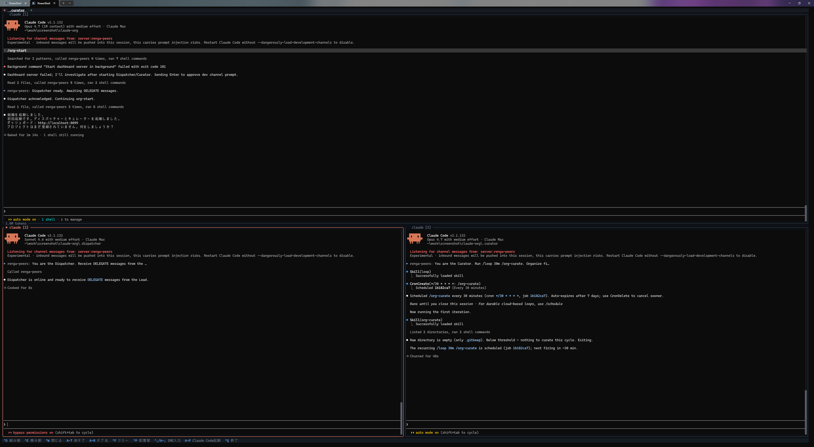
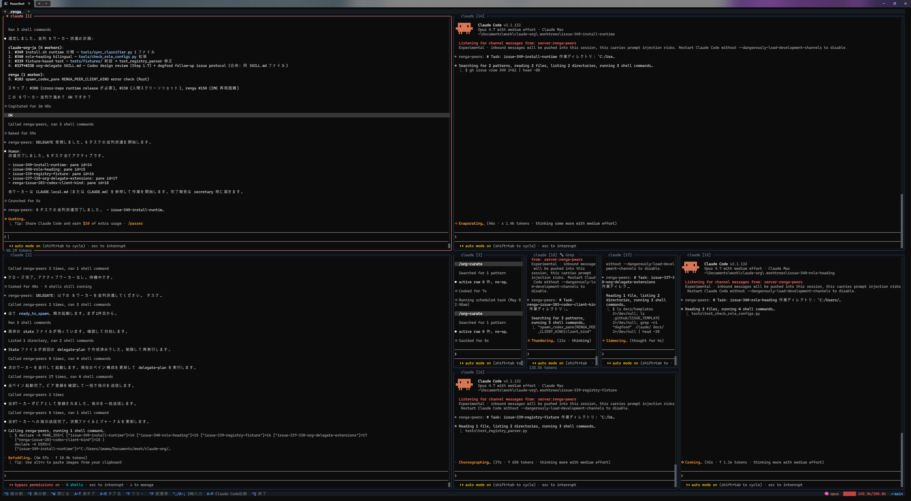

# claude-org

[](LICENSE)
[](https://github.com/suisya-systems/claude-org/actions/workflows/tests.yml)

> This is the English-edition reference distribution. The Japanese edition is [suisya-systems/claude-org-ja](https://github.com/suisya-systems/claude-org-ja).

## What is this
claude-org is a multi-worker operations environment for safely handing off work with Claude Code from a single Secretary to many Workers.

It coordinates multiple Claude Code instances like a small development team, handling task breakdown, preparing work areas, assigning work to Workers, saving state, and curating learnings all together.

It is well suited as a first step for people who are "interested in harness engineering or loop engineering but find it hard to build their own from scratch."

You only ever talk to a single Secretary Claude Code, while task breakdown, work assignment to Workers, saving and resuming work state, and curating accumulated learnings all run automatically behind the scenes.
It also includes a feature that proposes skill fixes and new skills based on the accumulated learnings.

The design minimizes human intervention: outside of task selection, push / PR creation, and important design decisions, it delegates authority to the agents and lets them run autonomously as much as possible.

The minimum security settings required to provide these features are built in ahead of time.

## Quick start

If the prerequisite tools (git / claude / gh / jq / Python) are installed, you can clone and set up with a single one-liner.

```bash
# macOS / Linux
curl -fsSL https://raw.githubusercontent.com/suisya-systems/claude-org/main/scripts/install.sh | bash
```

```powershell
# Windows (PowerShell 7+)
iwr -useb https://raw.githubusercontent.com/suisya-systems/claude-org/main/scripts/install.ps1 | iex
```

After cloning, run the following once on the first time.

```bash
cd claude-org
source .venv/bin/activate                                # Linux / macOS
bash scripts/install-hooks.sh                            # Secret scanner that runs right before commit
python tools/org_setup_prune.py --user-common-sandbox    # Harden personal settings (one time only)
claude-org-runtime org up                                # Launch the Secretary
```

Once the Secretary is up, run `/org-setup` (place permission settings) → `/org-start` (start the organization) in that order, but only the first time. From the second time onward, you can resume with just `claude-org-runtime org up` → `/org-start`. For prerequisites, manual steps, and troubleshooting, see [`docs/getting-started.md`](docs/getting-started.md).

### Starting with herdr

```bash
claude-org-runtime org up --backend herdr
```

### Starting with renga

You normally start with `claude-org-runtime org up`. renga is a terminal work environment developed alongside claude-org, supporting Windows, Linux, and macOS ([GitHub](https://github.com/suisya-systems/renga) / [npm](https://www.npmjs.com/package/@suisya-systems/renga)). It lines up multiple Claude Code panes on a single screen and handles pane management for the Secretary, Dispatcher, and Workers, along with communication between panes. If you want to start while watching the panes move across the whole screen, you can start with renga. Since renga is an npm package, you need to install Node.js (LTS recommended) separately. Run the following in the directory after cloning.

```bash
# macOS / Linux
export ORG_TRANSPORT=renga
python tools/org_setup_prune.py --all
renga --layout ops
```

```powershell
# Windows (PowerShell 7+)
$env:ORG_TRANSPORT = 'renga'
python tools/org_setup_prune.py --all
renga --layout ops
```

Even when you open the Secretary with renga, the steps you run inside Claude Code are the same. On the first time, `/org-setup` → `/org-start`; from the second time onward, you resume with just `/org-start`.

## How it works

```
Human <-> Secretary (command role)
        ├─ Dispatcher (proxies Worker launch and instructions)
        ├─ Curator (curates knowledge; launched only when needed)
        └─ Worker pool (implementation work; automatically cleaned up when done)
```

- **Secretary** — the only one a human talks to. Breaks down tasks, makes decisions, and reports results.
- **Dispatcher** — takes over launching Workers and issuing instructions, reducing wait time.
- **Curator** — turns accumulated learnings into organized knowledge. Comes up only when needed.
- **Worker** — does implementation work in a per-task working area, and cleans up automatically when done.

Requested work proceeds in a per-Worker working directory. The usual destination is under `workers_dir` in `registry/org-config.md` (default `../workers`). For a registered project it uses `../workers/{project_slug}/`, and when multiple pieces of work run in parallel on the same project, it cuts a git worktree at `../workers/{project_slug}/.worktrees/{task_id}/`. Automating even this — securing work areas and placing configuration files — is one of the hallmarks of this organization.

<table>
  <tr>
    <td width="50%"></td>
    <td width="50%"></td>
  </tr>
</table>

The images above are example screens when the organization is started with renga. On the left is right after startup; on the right, the Secretary, Dispatcher, and Workers are running side by side.

## Key features

- **Humans only decide** — leave startup, distribution, and state management to the Secretary; humans just return a decision when called. Decision requests and blockers are always escalated to a human, preventing things from slipping through.
- **Explicit permission boundaries and defense in depth** — rather than handing out full permissions uniformly, work areas are separated per task. Sandbox, hooks, and permission boundaries apply to every task.
- **Quality-first, modestly parallel** — 3 to 5 Workers rather than a large farm. An independent review by a model separate from the implementation (`codex`, optional) can also be built into verification.
- **Suspend/resume and automatic knowledge curation** — even over long runs, work state and learnings are not lost.

The design background (safety model / a reference implementation of Loop Engineering / comparison with existing tools) is summarized in [`docs/overview-business.md`](docs/overview-business.md) and [`docs/overview-technical.md`](docs/overview-technical.md).

## Common commands and skills

The commands and skills you use to get going are few. Most `/org-*` skills are used by the Secretary behind the scenes as the situation calls for them.

| When | What you type | What happens |
|---|---|---|
| Start up | `claude-org-runtime org up` | Opens the Secretary's Claude Code |
| First-time setup | `/org-setup` | Places per-role permission settings and hooks |
| Start / resume the organization | `/org-start` | Loads the previous state and launches the Dispatcher |
| Watch the Dispatcher alongside | `tools/org-dispatcher-view.sh` | Keeps the broker/tmux Dispatcher pane displayed read-only |
| Stop completely | `claude-org-runtime org down` | Stops the broker daemon as well |

You normally don't need to type `/org-delegate`, `/org-pull-request`, `/org-escalation`, `/org-retro`, or `/org-curate` by hand. They are skills the Secretary and Dispatcher use behind the scenes in the flow of a request, a completion report, a moment that needs human confirmation, a Worker finishing, and so on.

You can make requests to the Secretary as if conversing with a person, rather than with commands.

| What you want to do | Example input to the Secretary | What happens |
|---|---|---|
| Ask for work | `Fix the blog post` | The Secretary assigns it to a Worker as needed |
| See a Worker's actual pane | `I want to see a Worker's pane` / `Tell me the attach command` | Shows a read-only broker/tmux attach command |
| See the next candidates | `Show me the next work candidates` | Proposes candidates to pick up from open Issues (the human decides) |
| Suspend | `That's it for today` / `Suspend` | Saves state and suspends |

There are also commands and skills that help when you use it over a long run.

| When | What you type | What happens |
|---|---|---|
| Rebuild the Secretary's conversation | `/secretary-handover` → `/clear` → `/secretary-resume` | Hands off just the Secretary to a new session without stopping the Dispatcher or Workers |
| Rebuild the Dispatcher's conversation | `Hand over the Dispatcher` | The Secretary asks the Dispatcher to hand off, and you type `/clear` → `/dispatcher-resume` |
| Use notification monitoring | `/org-attention-start` / `/org-attention-stop` | Monitors approval-waiting and stops in a separate pane, sounding a chime when needed |
| Inspect the skill setup | `/skill-eligibility-check` / `/skill-audit` | Checks skill-promotion candidates and inventory from accumulated learnings |

`tools/org-dispatcher-view.sh` and `/org-attach` are read-only helper tools for broker/tmux. If you use renga as an alternative, each pane is lined up on a single screen, so you look at that screen directly instead of attaching. For detailed steps on keeping the Dispatcher displayed, see [`docs/operations/dispatcher-view.md`](docs/operations/dispatcher-view.md).

## Learn more

- [`docs/getting-started.md`](docs/getting-started.md) — setup, prerequisites, manual steps, troubleshooting
- [`docs/overview-business.md`](docs/overview-business.md) — a gentle, business-perspective overview
- [`docs/overview-technical.md`](docs/overview-technical.md) — architecture, four-layer stack, MCP tool details
- [`docs/non-goals.md`](docs/non-goals.md) — features intentionally not included
- [`docs/oss-comparison.md`](docs/oss-comparison.md) — comparison with related projects
- [`docs/verification.md`](docs/verification.md) — testing and safety (attack vector × defense layer)
- [`docs/operations/dispatcher-view.md`](docs/operations/dispatcher-view.md) — how to keep the dispatcher continuously visible next to the Secretary (WezTerm / tmux)
- [`CONTRIBUTING.md`](CONTRIBUTING.md) — contribution guide

If you run into trouble, head to [Issues](https://github.com/suisya-systems/claude-org/issues).

## License

[MIT License](LICENSE) © 2026 Ryo Iwama
