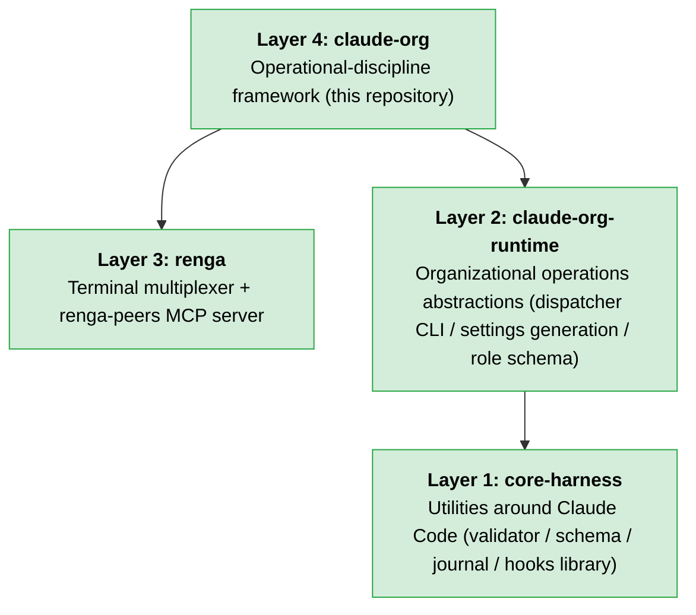

# claude-org

[](LICENSE)
[](https://github.com/suisya-systems/claude-org/actions/workflows/tests.yml)
[](#quick-start)

> **claude-org is the English-edition reference distribution.**
> Japanese edition: [suisya-systems/claude-org-ja](https://github.com/suisya-systems/claude-org-ja) (a dual Japanese/English repository setup. See [`docs/sync-policy.md`](docs/sync-policy.md) for synchronization rules between the two repositories).

---

## Glossary

Minimal definitions of frequently used role names and related tools in this repository. Each linked document is the primary source.

| Term | Meaning | Primary source |
|---|---|---|
| **Lead** | The only Claude instance that serves as the human-facing contact point. It is responsible only for task breakdown, delegation decisions, and communicating results; it does not perform implementation work itself. | [`CLAUDE.md`](CLAUDE.md) |
| **Dispatcher** | A proxy role that receives instructions from the Lead, launches worker panes, and hands over work instructions. It minimizes the time the Lead is blocked. | [`.dispatcher/CLAUDE.md`](.dispatcher/CLAUDE.md) |
| **Curator** | An automated loop role that turns raw learnings accumulated in `knowledge/raw/` into organized knowledge. It runs every 30 minutes. | [`.curator/CLAUDE.md`](.curator/CLAUDE.md) |
| **Worker** | The implementation role launched per task. It handles everything from code edits through commits within a dedicated working-directory boundary (`git push` / pull request creation remain the responsibility of the Lead, and Workers do not have permission to create PRs). | [`.claude/skills/org-delegate/SKILL.md`](.claude/skills/org-delegate/SKILL.md) |
| **renga** | The Layer 3 terminal multiplexer + `renga-peers` MCP server. It provides pane control and P2P messaging between panes. | [suisya-systems/renga](https://github.com/suisya-systems/renga) |
| **ccmux** | The former name of `renga`. It was renamed to `renga` during the M3 migration and now remains only in historical documents and migration tools. | [`docs/operations/m3-migration-runbook.md`](docs/operations/m3-migration-runbook.md) |

---

## 30-Second Pitch

**Problem**: You want to run Claude Code for long periods in a "one Lead + many Workers" setup. But Claude Code assumes a single session, and there is no official operations layer for safely coordinating multiple instances. Simple tmux-like pane splitting or fully automated farm-style parallelism leaves out the **operational discipline** around permission boundaries, knowledge accumulation, state restoration, and per-task environment setup.

**Solution**: claude-org is an **operational-discipline framework** dedicated to Claude Code. By talking to a single Lead Claude, Dispatcher, Curator, and Worker roles are derived automatically behind the scenes, and it **enforces from the start** a narrow allowlist, per-task working-directory boundaries, automatic knowledge curation every 30 minutes, and suspend/resume state handling.

**Target users**: Developers and operators who want to run Claude Code for long stretches in real work, especially those who want explicit permission boundaries instead of full automation, want to run 3 to 5 Workers with a quality-first approach, and want a self-improving knowledge loop.

---

## Prerequisites

Whether you use the one-liner or the manual steps, you need to install the following tools in advance. The installers (`scripts/install.sh` / `scripts/install.ps1`) fail closed when checking for the four required commands `git` / `claude` / `renga` / `gh`; Python produces only a warning, and `jq` / Node.js are not checked (they are not auto-installed). To cover the use cases in the table below, all seven tools are required.

| Tool | Minimum version | Purpose | Install link |
|---|---|---|---|
| **`git`** | Any stable 2.x release | Repository checkout (`git clone`), commits, Worker working-directory management | [git-scm.com/downloads](https://git-scm.com/downloads) |
| **GitHub CLI (`gh`)** | Any stable 2.x release | Pull request creation, Issue operations, CI monitoring (`gh pr checks --watch`) | [cli.github.com](https://cli.github.com/) |
| **Node.js** | v18+ | Runtime for installing `renga` via npm | [nodejs.org](https://nodejs.org/) |
| **Python** | 3.10+ | Running `pip install -e .` for `core-harness` / `claude-org-runtime` (aligned with `requires-python` in `pyproject.toml`) | [python.org/downloads](https://www.python.org/downloads/) |
| **`jq`** | 1.6+ | Formatting and extracting `.state/` JSON / `gh api` output (used in hooks and tools) | [jqlang.org/download](https://jqlang.org/download/) |
| **Claude Code CLI (`claude`)** | Latest stable release | Main executable for each role pane. Initial login is also done when launching `claude` | [claude.ai/code](https://claude.ai/code) |
| **`renga`** | 0.18.0+ | The Layer 3 terminal multiplexer + `renga-peers` MCP server (`npm install -g @suisya-systems/renga@0.18.0`) | [github.com/suisya-systems/renga](https://github.com/suisya-systems/renga) |

---

## Four-Layer Architecture

claude-org is a reference distribution positioned at **Layer 4** of a four-layer stack. It depends on Layer 3 (terminal multiplexer + MCP server = `renga`) and Layer 2 (organizational operations runtime = `claude-org-runtime`), and Layer 2 further depends on Layer 1 (`core-harness` = minimal utilities around Claude Code). Layer 3 is independent from Layer 1 and can be used as a standalone terminal multiplexer even without `renga`.



As of the completion of Phase 5, **Layers 1 / 2 / 3 have all already been published as independent OSS packages**, and claude-org (Layer 4) is a thin shim that consumes Layers 1 to 3. See [docs/overview-technical.md](docs/overview-technical.md) for details on each layer's responsibilities.

- **Layer 1: `core-harness`** — Published as an independent OSS repository under v0.3.x ([suisya-systems/core-harness](https://github.com/suisya-systems/core-harness)). Provides validator / schema / journal / hooks library, and is consumed by both Layer 2 and claude-org (Phase 3 / Issue [#128](https://github.com/suisya-systems/claude-org/issues/128) closed).
- **Layer 2: `claude-org-runtime`** — Published to PyPI under v0.1.x. Provides the dispatcher CLI, `settings.local.json` generation, and bundled role schemas. claude-org delegates dispatch plan generation and Worker settings generation to this package (Phase 4 / Issue [#129](https://github.com/suisya-systems/claude-org/issues/129) closed).
- **Layer 3: `renga`** — A Rust TUI + MCP server. Conforms to the Set D backend interface contract. `renga` itself is already distributed standalone and can be used as a general-purpose terminal multiplexer outside AI development as well.
- **Layer 4: `claude-org` (this repository)** — A Japanese-first distribution that consumes Layers 1 to 3. The English edition [`claude-org`](https://github.com/suisya-systems/claude-org) is also a peer at this layer.

> Note: Whether to extract the orchestration glue (the skill layer) into a separate OSS package as `claude-org-skills` remains an additional extraction item internal to Layer 4, and the decision is currently on hold (see Q1=b in [`docs/internal/phase5-decisions-2026-05-03.md`](docs/internal/phase5-decisions-2026-05-03.md)). Even if that decision proceeds, the four-layer structure above will not change; part of `.claude/skills/` inside claude-org would simply move to an external repository.

### What remains in this repository (ja-specific)

As of Phase 5 (after Layers 1/2/3 were extracted), the ja-specific components that remain in claude-org are as follows (confirmed by the Lead, [`docs/internal/phase5-decisions-2026-05-03.md`](docs/internal/phase5-decisions-2026-05-03.md) Q5/Q6/Q7):

- The full skill set under `.claude/skills/` (`/org-*` operational skills + `/skill-*` meta-skills) — all 10 skills remain in-tree because Layer 3 extraction was deferred
- Japanese prose templates: `.dispatcher/CLAUDE.md` / `.curator/CLAUDE.md` (consumer-side overrides for the Layer 2 English reference)
- ja locale hooks (`.hooks/` / `.githooks/`, with deny messages localized into Japanese)
- `dashboard/` — an SPA for visualizing organization state (confirmed to remain in claude-org by Phase 4 Q9=c)
- ja-specific operational tools: `tools/check_renga_compat.py` / `tools/gen_worker_brief.py` / `tools/org_setup_prune.py` / `tools/journal_*` / `tools/pr_watch.*` / `tools/state_migrate.py` / `tools/state_db/` (state DB writer / importer / drift_check / curator_archive; after the live migration in Issue [#267](https://github.com/suisya-systems/claude-org/issues/267), `.state/state.db` is the only source of truth for organization state. `.state/org-state.md` is a derived artifact automatically regenerated by the post-commit processing of `StateWriter.transaction()`, and `.state/journal.jsonl` was removed in M4)
- ja-specific schemas and locale data: `tools/ja_locale.json` / `tools/org_extension_schema.json`
- Installation scripts: `scripts/install.sh` / `scripts/install.ps1` / `scripts/install-hooks.sh`

---

## Quick Start

### One-liner (recommended)

If the dependency tools (`git` / `claude` / `renga` / `gh`) are already installed, you can run clone + `renga mcp install` in one shot with the following one-liner.

**macOS / Linux (bash)**:

```bash
curl -fsSL https://raw.githubusercontent.com/suisya-systems/claude-org/main/scripts/install.sh | bash
```

**Windows (PowerShell 7+)**:

```powershell
iwr -useb https://raw.githubusercontent.com/suisya-systems/claude-org/main/scripts/install.ps1 | iex
```

The script checks whether the prerequisite commands are installed, and if anything is missing it **shows installation instructions and exits** (it does not auto-install anything). After it finishes, launch with the following steps:

```bash
cd claude-org
bash scripts/install-hooks.sh   # Enable the secret scanner that runs right before commits
renga --layout ops              # Launch the Lead pane
```

#### If you want to pin a specific version (`CLAUDE_ORG_REF`)

By default, the installer clones the `main` branch (this is fine if you want to try the **latest features**).

If you want to prioritize **reproducibility** or align the team on the same version, you can specify any **branch / tag** with the `CLAUDE_ORG_REF` environment variable. See the [Releases page](https://github.com/suisya-systems/claude-org/releases) for the current stable tag.

For full reproducibility, it is recommended to **fetch the installer itself from the same ref** as well (otherwise, even if the clone target is pinned, the installer logic itself still tracks `main`).

**macOS / Linux (bash)**:

```bash
REF=v0.1.0
curl -fsSL "https://raw.githubusercontent.com/suisya-systems/claude-org/${REF}/scripts/install.sh" | CLAUDE_ORG_REF="${REF}" bash
```

**Windows (PowerShell 7+)**:

```powershell
$Ref = 'v0.1.0'
$env:CLAUDE_ORG_REF = $Ref
iwr -useb "https://raw.githubusercontent.com/suisya-systems/claude-org/$Ref/scripts/install.ps1" | iex
```

If omitted, the behavior remains the same as before and clones `main`. If you specify a ref that does not exist, the installer **fails explicitly and aborts** (it aborts when `git clone --branch` fails to resolve it).

### Manual steps (if you do not use the one-liner)

```bash
# 1. Install the dependency tools (see the "Prerequisites" section for the list and minimum versions)
npm install -g @suisya-systems/renga@0.18.0

# 2. Authentication
gh auth login
claude                          # Initial login to Claude Code

# 3. Get this repository
git clone https://github.com/suisya-systems/claude-org.git
cd claude-org

# 4. Install Python dependencies (core-harness / claude-org-runtime)
#    pyproject.toml is the source of truth. requirements.txt remains only as a thin compatibility file.
pip install -e .

# 5. Register renga's MCP server with Claude Code (first time only)
renga mcp install

# 6. Launch the Lead pane
renga --layout ops
```

Once Claude Code starts in the Lead pane, run `/org-setup` **only the first time** to place the role-specific permissions and hook configuration:

```
/org-setup
```

Then start the organization:

```
/org-start
```

This will derive the Dispatcher and Curator, and from then on you only need to submit requests in natural language. See [docs/getting-started.md](docs/getting-started.md) for details.

---

## Why use this? (comparison with existing tools)

| Compared with | Positioning | How it differs from claude-org |
|---|---|---|
| **Claude Code Subagents / Agent Teams (official)** | Anthropic's official "lead / teammate" hierarchy + automatic memory + hooks | claude-org is an operations layer on top of the official system. It **coexists rather than competes**. It adds what the official offering does not provide: **enforced per-task working-directory boundaries**, schema-driven config drift detection, a refinement pipeline from raw learnings to organized knowledge, and an automatic curation loop every 30 minutes |
| **ccswarm (Rust-based coordination layer without a multiplexer)** | Fixed role pool (frontend / backend / QA agents, etc.) + oriented toward large-scale parallelism | claude-org **generates the working directory and `CLAUDE.md` fresh for each task** (it does not keep a prebuilt role pool). It is quality-first with 3 to 5 Workers, which is the opposite direction from farm-style systems |
| **Aider / aider-codex / Cursor agents** | Editor-integrated solo agents, or coding assistants that support switching among multiple models | claude-org is not a coding assistant but an **organizational operations runtime**. It uses Claude Code directly and enforces organizational operating discipline |
| **tmux / zellij + manual prompt splitting** | General-purpose terminal multiplexers + human-operated pane management | claude-org provides **P2P messaging between panes, structured pane creation, and state suspend/resume** through a dedicated MCP server (`renga-peers`). Its core value is what manual operation lacks: role contracts, automatic knowledge curation, and role-specific permission distribution |

→ For a more detailed 16-axis comparison, see [docs/oss-comparison.md](docs/oss-comparison.md).

---

## How it works

```
Human <-> Lead Claude (command role)
              |
              +-> Dispatcher (launches Workers and relays instructions)
              +-> Curator (organizes knowledge, runs automatically every 30 minutes)
              +-> Worker pool (implementation work, automatically disappears after completion)
```

- **Lead**: The only human-facing contact point. Handles task breakdown, delegation decisions, and result reporting
- **Dispatcher**: Relays pane launches and instruction delivery, minimizing the time the Lead is blocked
- **Curator**: Turns accumulated raw learnings into organized knowledge and proposes improvements to skills and processes
- **Worker**: Handles implementation work. It autonomously works through commit within the per-task working-directory boundary (pull request creation stays on the Lead side), and records raw learnings after completion

All panes run within the same tab (`new_tab`, which opens a separate tab, is not used for organizational operations).

---

## Features intentionally not included (summary)

To explicitly state the design philosophy of claude-org, these are the **five things it intentionally does not include**:

1. **It does not distribute `--dangerously-skip-permissions` to Workers by default** — narrow permission entries plus defense in depth are a core value. It does not universally hand out full permission-boundary bypass to implementation roles (only the Dispatcher uses `bypassPermissions` as an operational necessity for Sonnet; see [docs/non-goals.md](docs/non-goals.md) §1 for details)
2. **It does not keep a fixed role pool (frontend / backend / QA agents)** — it generates a working directory and `CLAUDE.md` fresh for each task. A prebuilt role pool conflicts with per-task discipline
3. **It does not do large-scale parallelism (20+ agents)** — it assumes 3 to 5 Workers. It is quality-first and points in the opposite direction from farm-style systems
4. **It does not generate project scaffolds from natural language (auto-create app)** — this is an operational-discipline framework, not a scaffold generator
5. **It does not switch among multiple providers (Aider / Codex / Gemini, etc.)** — it is Claude-specific. `codex` is assumed only for optional review use

For the details, the remaining seven non-goals (PTY layer / cross-`--add-dir` / HTTP exposure of MCP, etc.), why they are excluded, and what alternatives exist, see [docs/non-goals.md](docs/non-goals.md).

---

## Skill list

Skills are divided into two groups by prefix. `/org-*` are for operating the organizational runtime (daily operations that directly handle panes, Workers, and state), while `/skill-*` are meta-operations on the skill system itself (deciding how to create or organize skills). When you add a new skill, follow this prefix convention.

### Organizational runtime operations (`/org-*`)

Used for day-to-day organizational operations such as startup, dispatch, suspension, and retrospectives.

| Skill | Purpose |
|---|---|
| `/org-setup` | Bulk placement of role-specific permission settings and environment variables (first time and whenever settings change) |
| `/org-start` | Start the organization (run once right after launch) |
| `/org-delegate` | Assign work (auto-triggered) |
| `/org-suspend` | Suspend work |
| `/org-resume` | Resume work |
| `/org-retro` | Review the delegation process |
| `/org-curate` | Curate knowledge (runs automatically) |
| `/org-dashboard` | Show the dashboard |

### Meta-operations on the skill system (`/skill-*`)

Used for decisions about creating and organizing skills themselves. They form a self-improving loop in the order of generation (eligibility-check) → inventory review (audit).

| Skill | Purpose |
|---|---|
| `/skill-eligibility-check` | Decide whether a work pattern should be turned into a skill (called from `/org-retro` / `/org-curate`, and returns one of three values: recommended / candidate-only / keep as a curated note) |
| `/skill-audit` | Review the skill inventory (detect deprecation candidates and duplicate skills to merge) |

---

## Documentation

| Document | Contents |
|---|---|
| [docs/getting-started.md](docs/getting-started.md) | Usage guide |
| [docs/overview-technical.md](docs/overview-technical.md) | Architecture and MCP tool details |
| [docs/non-goals.md](docs/non-goals.md) | Details of intentionally excluded features |
| [docs/oss-comparison.md](docs/oss-comparison.md) | Comparison report with related projects (16 axes) |
| [docs/verification.md](docs/verification.md) | Test procedures and verification results |
| [CONTRIBUTING.md](CONTRIBUTING.md) | Contribution guide |

---

## Security and permission boundaries

claude-org uses **four layers of defense** (`permissions.deny` / PreToolUse hook / sandbox / secret scanner right before commit). However, **each layer applies differently depending on the role**:

- **Worker / Lead / Curator (`auto` mode)**: Both `permissions.deny` and `permissions.allow` are active. The PreToolUse hook is also active. All four defensive layers are fully in effect
- **Dispatcher (`bypassPermissions` mode)**: `permissions.deny` and `permissions.allow` are **bypassed** (only the write-confirmation prompt remains for protected directories `.git/`, `.claude/`, `.vscode/`, `.idea/`, `.husky/`). Effective defenses are the **deployed PreToolUse hooks**: scope limiting for Edit/Write (`only .dispatcher/`, `.state/`, and `knowledge/raw/YYYY-MM-DD-{topic}.md`; everything else is blocked with exit 2), blocking `git push --force` variants, destructive `git`, recursive worker deletion, and `--no-verify`. This is supplemented by self-discipline under the role contract and monitoring by the Lead

Validation bypasses such as `git push --no-verify`, history-rewriting `git push --force` variants, and accidental inclusion of secrets in staged diffs are stopped by multiple layers for roles in `auto` mode. For reads of `.env` files and credentials, enforcement of `sandbox.enabled` depends on the OS in Claude Code, and **sandbox enforcement is currently not implemented on native Windows**; observed behavior shows `cat .env` passes straight through there (see [docs/verification.md §sandbox measured results](docs/verification.md)). The sandbox is active only on macOS (Seatbelt) / Linux / WSL2 (when `bubblewrap` + `socat` are installed). See [docs/non-goals.md §1](docs/non-goals.md#1-it-does-not-distribute---dangerously-skip-permissions-to-workers-by-default) for the Dispatcher-side self-discipline defined by the role contract and a precise breakdown of behavior in bypass mode.

See [docs/overview-technical.md](docs/overview-technical.md) and the contents of `.hooks/` / `.githooks/` for each layer's responsibility boundary, known residual risks (such as bypasses via function definitions), and the detection scope of the PreToolUse hooks.

### Attack vector × defense layer matrix

This is a response matrix for major attack vectors and each defensive layer, based on this repository's own `.claude/settings.json` (for Lead and Curator, `auto` mode) and `.githooks/pre-commit` (✅ blocked / ⚠️ partial or conditional / — out of scope / ➖ not deployed). **In the Worker role template (`.claude/skills/org-setup/references/permissions.md`), `permissions.deny` covers only `git push` variants and `rm -r` / `rm -rf`, and the deployed PreToolUse hooks are `check-worker-boundary.sh` / `block-org-structure.sh` / `block-git-push.sh`** (`block-no-verify.sh` / `block-dangerous-git.sh` are not deployed on the Worker side). Direct blocking of `--no-verify` / `git reset --hard` / `git branch -D` applies only to the Lead and Curator in this repository. Workers block `git push` entirely through `block-git-push.sh`, so push variants including `--force` are stopped indirectly, but local `git commit --no-verify` and `git reset --hard` are intentionally left to self-discipline under the role contract (the Dispatcher is managed separately with an independent hook set for `.dispatcher/`).

| Attack vector | `permissions.deny` | PreToolUse hook | sandbox | pre-commit |
|---|---|---|---|---|
| Direct `git commit --no-verify` (Lead / Curator) | ✅ | ✅ (`block-no-verify.sh`) | — | — |
| `eval "git commit --no-verify"` / `bash -c "..."` | — | ✅ Phase 2a [#79](https://github.com/suisya-systems/claude-org/issues/79): explicit parsing with `unwrap_eval_and_bashc` | — | — |
| `VAR=$(printf -- '--no-verify'); git commit $VAR` | — | ✅ assignment collection + `flatten_substitutions` | — | — |
| `git push --force` / `git reset --hard` / `git branch -D` (Lead / Curator) | ✅ | ✅ (`block-dangerous-git.sh`) | — | — |
| `cat .env` / credential read (via Bash) | — | — | ⚠️ Only on macOS (Seatbelt) / Linux / WSL2 (`bubblewrap`+`socat`). **Native Windows passes through because Claude Code does not implement it there yet** ([docs/verification.md §10.1](docs/verification.md)) | — |
| `Read(~/.ssh/*)` / `Read(~/.aws/*)` (home dotfile reads via the Read tool) | ✅ ([Issue #83](https://github.com/suisya-systems/claude-org/issues/83)) | — | — | — |
| Secret leakage into staged diffs | — | — | — | ✅ ([.githooks/pre-commit](.githooks/pre-commit)) |
| Bypass via shell functions (`f(){ git commit --no-verify; }; f`) | — | ➖ Static analysis of function definitions is not supported | — | — |

**Residual risk**:
- **Routing through shell function definitions**: Prohibited commands hidden inside function bodies cannot be detected by the static analysis of the PreToolUse hook (the shell-layer static analysis considered in Phase 2c was rejected due to false-positive rate and maintenance cost). The sandbox's `denyWrite` also covers only a limited list such as `~/.claude/settings.json`, and does not stop repository side effects such as `git commit` (for home dotfiles `~/.ssh` / `~/.aws`, the policy was changed to defend on the Read side of `permissions.deny` to avoid sandbox init failures on WSL2; see [Issue #83](https://github.com/suisya-systems/claude-org/issues/83)). At present, this vector is covered only by self-discipline under the role contract.
- **No sandbox on native Windows**: As shown in the table above, `cat .env` and similar commands pass through on native Windows. macOS / Linux / WSL2 are recommended as Worker execution environments; on native Windows, supplement this through other paths such as OS-side file permissions and GitHub Secret Scanning.
- **Thin deny rules for the Worker role**: The Worker's `permissions.deny` template is intentionally kept small, and direct blocking of local `git commit --no-verify` / `git reset --hard` is not deployed (`git push` itself is fully blocked by hooks, so `--force` is stopped indirectly). The remaining risk relies on the role contract and CI protections on the Lead side.

See [Issue #79](https://github.com/suisya-systems/claude-org/issues/79) and [docs/verification.md §10](docs/verification.md) for details and the phased deployment decisions.

After cloning the repository, run the following once:

```bash
bash scripts/install-hooks.sh
```

This sets `core.hooksPath` to `.githooks/` and enables the secret scanner that runs right before commit.

---

## Troubleshooting

- **Nothing happens after `/org-start`** → Check whether Claude Code in the Lead pane is already logged in (launch `claude` and complete initial authentication). Also check whether `renga-peers` appears in `claude mcp list`
- **The `renga-peers` MCP server is not visible** → Check the registration state with `renga mcp status`, and if it is not registered, rerun `renga mcp install` (it is registered in user scope, so it is reflected immediately in all panes)
- **`gh auth status` says Not logged in** → Complete GitHub authentication with `gh auth login`. Without authentication, the Lead cannot create pull requests (PR creation is the Lead's responsibility; Workers go only up through commit)
- **Preflight compatibility check**: `tools/check_renga_compat.py` can check the `renga` version and MCP tool set all at once

If that still does not solve it, open an [Issue](https://github.com/suisya-systems/claude-org/issues).

---

## License

[MIT License](LICENSE) © 2026 Ryo Iwama
