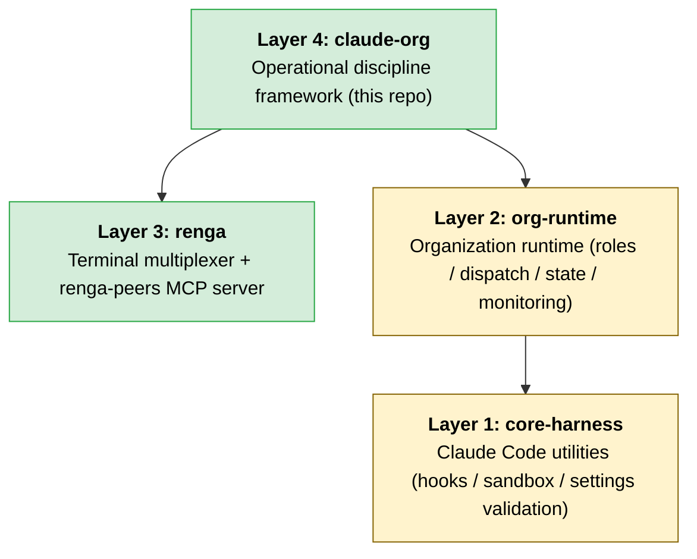

# claude-org

[](LICENSE)
[](https://github.com/suisya-systems/claude-org/actions/workflows/tests.yml)
[](#quick-start)

> **claude-org is the English-first reference distribution.**
> The Japanese-first sibling repository [`suisya-systems/claude-org-ja`](https://github.com/suisya-systems/claude-org-ja) ships in lockstep. Translations between the two are tracked in [`docs/translation-manifest.md`](docs/translation-manifest.md); locked terminology lives in [`docs/glossary.md`](docs/glossary.md).

---

## The 30-second pitch

**Problem.** You want to keep Claude Code running productively for hours, with a single human-facing entry point and a small fleet of Workers behind it. Claude Code itself is built around one session at a time; coordinating multiple instances safely is left to you. Naive `tmux`-style splits and the popular "agent farm" approach both skip the operational discipline that long-running multi-agent work actually needs: narrow permission boundaries, persisted knowledge, suspend/resume of the whole organization, and a fresh per-task working directory.

**Solution.** claude-org is an **operational discipline framework** for Claude Code. You talk to a single Lead Claude; behind it, a Dispatcher, a Curator, and short-lived Workers are spawned automatically. From the first command, the framework enforces narrow allowlists per role, per-task working-directory boundaries, automatic knowledge curation every 30 minutes, and full suspend/resume of organization state.

**Who it's for.** Developers and operators who want to run Claude Code as a sustained workflow — and who specifically want **explicit permission boundaries over full autonomy**, **3–5 quality-focused Workers over 20+ farm-style ones**, and a **self-improving knowledge loop** as a first-class concern.

---

## Four-layer architecture

claude-org sits at **Layer 4** of a four-layer stack. It depends on Layer 3 (the [`renga`](https://github.com/suisya-systems/renga) terminal multiplexer plus its `renga-peers` MCP server) and Layer 2 (an organization-runtime abstraction); Layer 2 in turn depends on Layer 1 (a minimal harness around Claude Code: hooks, sandbox, settings validation). Layer 3 is independent of Layer 1 — `renga` is usable on its own as a general-purpose multiplexer.



The green boxes (Layer 3 / Layer 4) ship today. The yellow boxes (Layer 1 / Layer 2) will be extracted from claude-org over time. `renga` is intentionally a general-purpose tool; claude-org is the reference distribution that puts organizational discipline on top of it. See [docs/overview-technical.md](docs/overview-technical.md) for per-layer responsibilities.

---

## Quick start

### One-liner (recommended)

If you already have `git`, `claude`, `renga`, and `gh` installed, the one-liner clones the repo and runs `renga mcp install` for you.

**macOS / Linux (bash):**

```bash
curl -fsSL https://raw.githubusercontent.com/suisya-systems/claude-org/main/scripts/install.sh | bash
```

**Windows (PowerShell 7+):**

```powershell
iwr -useb https://raw.githubusercontent.com/suisya-systems/claude-org/main/scripts/install.ps1 | iex
```

The installer checks for the prerequisites and **prints install instructions and exits** if anything is missing — it does not auto-install dependencies. Once it finishes:

```bash
cd claude-org
bash scripts/install-hooks.sh   # enable the pre-commit secret scanner
renga --layout ops              # launch the Lead pane
```

#### Pinning a specific version (`CLAUDE_ORG_REF`)

By default the installer clones `main` (use this to track the **latest features**).

For **reproducibility** — same version across a team — set `CLAUDE_ORG_REF` to any branch or tag. Stable tags are listed on the [Releases page](https://github.com/suisya-systems/claude-org/releases).

For full reproducibility, **fetch the installer itself from the same ref** you pin; otherwise the clone target is pinned but the installer logic still tracks `main`.

**macOS / Linux (bash):**

```bash
REF=v0.1.0
curl -fsSL "https://raw.githubusercontent.com/suisya-systems/claude-org/${REF}/scripts/install.sh" | CLAUDE_ORG_REF="${REF}" bash
```

**Windows (PowerShell 7+):**

```powershell
$Ref = 'v0.1.0'
$env:CLAUDE_ORG_REF = $Ref
iwr -useb "https://raw.githubusercontent.com/suisya-systems/claude-org/$Ref/scripts/install.ps1" | iex
```

If `CLAUDE_ORG_REF` is unset the installer clones `main` as before. A non-existent ref aborts explicitly (`git clone --branch` fails fast).

### Manual setup (no one-liner)

```bash
# 1. Install prerequisites
#    Claude Code (https://claude.ai/code), gh, Node.js v18+, Python 3.8+, jq
#    renga (Layer 3) requires 0.18.0 or newer:
npm install -g @suisya-systems/renga@0.18.0

# 2. Authenticate
gh auth login
claude                          # first-time Claude Code login

# 3. Clone this repo
git clone https://github.com/suisya-systems/claude-org.git
cd claude-org

# 4. Register the renga MCP server with Claude Code (one-time)
renga mcp install

# 5. Launch the Lead pane
renga --layout ops
```

When Claude Code comes up in the Lead pane, run `/org-setup` **once** to lay down per-role permissions and hooks:

```
/org-setup
```

Then bring up the organization:

```
/org-start
```

This dispatches the Dispatcher and Curator. From here on, you talk to the Lead in natural language. See [docs/getting-started.md](docs/getting-started.md) for the full walkthrough.

---

## Why this, and how it differs from related work

| Compared to | Their position | How claude-org differs |
|---|---|---|
| **Claude Code Subagents / Agent Teams (official)** | Anthropic's own lead/teammate hierarchy with auto-memory and hooks | claude-org is an operational layer **on top of** the official feature, not a competitor. It adds what the official feature does not enforce: per-task working-directory boundaries, schema-driven detection of settings drift, a raw → curated knowledge promotion pipeline, and a 30-minute auto-curation loop. |
| **ccswarm (Rust, multiplexer-less coordination)** | Fixed role pool (frontend / backend / QA agents, etc.) optimized for high parallelism | claude-org generates a **fresh working directory and `CLAUDE.md` per task** rather than maintaining a pre-allocated role pool. It targets 3–5 Workers with a quality-first stance — explicitly the opposite of the farm pattern. |
| **Aider / aider-codex / Cursor agents** | Editor-integrated single agents, or coding helpers with multi-model switching | claude-org is not a coding helper. It is an **organization runtime** that drives stock Claude Code and enforces operational discipline around it. |
| **`tmux` / `zellij` + manual prompt-splitting** | General multiplexers driven entirely by humans | claude-org adds a purpose-built MCP server (`renga-peers`) that provides **pane-to-pane P2P messaging, structured pane spawning, and full suspend/resume of state**. The role contracts, automatic knowledge curation, and per-role permission distribution are the parts you don't get from manual operation. |

For the full 16-axis comparison see [docs/oss-comparison.md](docs/oss-comparison.md).

---

## How it works

```
human <-> Lead Claude (single point of contact)
              |
              +-> Dispatcher (spawns Workers and relays instructions)
              +-> Curator (knowledge curation, runs every 30 min)
              +-> Workers (do the actual work, exit when finished)
```

- **Lead.** The single human-facing role. Decomposes requests, decides what to dispatch, relays results back. Never edits code directly.
- **Dispatcher.** Spawns Worker panes and forwards instructions, so the Lead is not blocked on per-Worker plumbing.
- **Curator.** Promotes raw learnings into curated knowledge and proposes skill or process improvements.
- **Worker.** Short-lived, scoped Claude instance that performs the actual editing, building, testing, and commits inside its per-task working-directory boundary, then records a raw learning when it exits.

All panes live in one tab; the cross-tab `new_tab` operation is intentionally not used for organization workflows.

---

## Things claude-org deliberately does not do

To make the design philosophy explicit, **five non-goals** out of the full list:

1. **No default `--dangerously-skip-permissions` for Workers.** Narrow allowlists and defense-in-depth are core values; Workers don't get a blanket bypass of permission boundaries. Only the Dispatcher uses `bypassPermissions` (a Sonnet-runtime constraint, see [docs/non-goals.md](docs/non-goals.md) §1).
2. **No fixed role pool** (frontend / backend / QA). A fresh working directory and `CLAUDE.md` are generated per task. A pre-allocated pool conflicts with per-task discipline.
3. **No high parallelism** (20+ agents). The target is 3–5 Workers, quality-first — the opposite of the farm pattern.
4. **No project-template generation from natural language** ("auto-create app"). claude-org is an operational discipline framework, not a scaffolder.
5. **No multi-provider switching** (Aider / Codex / Gemini, etc.). Claude-only by design. `codex` is supported strictly as an optional reviewer.

The remaining seven non-goals (PTY layer, cross-`--add-dir` traversal, exposing MCP over HTTP, etc.), the reasoning behind them, and the available alternatives are in [docs/non-goals.md](docs/non-goals.md).

---

## Skills

Skills are split into two prefixes. `/org-*` is day-to-day organization runtime control (panes, Workers, state). `/skill-*` is meta — operating on the skill catalog itself. New skills should follow this convention.

### Organization runtime (`/org-*`)

Startup, dispatch, suspend, retro — the everyday operations.

| Skill | Purpose |
|---|---|
| `/org-setup` | Lay down per-role permissions and environment (one-time, plus on settings changes). |
| `/org-start` | Bring up the organization (run once after launch). |
| `/org-delegate` | Assign work (triggered automatically). |
| `/org-suspend` | Suspend the organization. |
| `/org-resume` | Resume from suspend. |
| `/org-retro` | Retrospective on a dispatch. |
| `/org-curate` | Knowledge curation (runs automatically). |
| `/org-dashboard` | Show the dashboard. |

### Skill-catalog meta (`/skill-*`)

Used to grow and tidy the skill catalog itself. Together they form a self-improving loop: generate (eligibility-check) → audit.

| Skill | Purpose |
|---|---|
| `/skill-eligibility-check` | Decide whether an observed pattern should become a skill. Called from `/org-retro` and `/org-curate`. Returns one of: recommended / candidate-only / leave as a curated note. |
| `/skill-audit` | Audit the skill catalog (deprecation candidates, duplicate consolidation). |

---

## Documentation

| Doc | Contents |
|---|---|
| [docs/getting-started.md](docs/getting-started.md) | Walkthrough |
| [docs/overview-technical.md](docs/overview-technical.md) | Architecture and MCP tool reference |
| [docs/non-goals.md](docs/non-goals.md) | The full non-goals list with rationale |
| [docs/oss-comparison.md](docs/oss-comparison.md) | 16-axis comparison with related projects |
| [docs/verification.md](docs/verification.md) | Test procedures and verification results |
| [docs/glossary.md](docs/glossary.md) | Locked terminology (en ↔ ja) |
| [docs/canonical-ownership.md](docs/canonical-ownership.md) | Which side is canonical for each artifact |
| [CONTRIBUTING.md](CONTRIBUTING.md) | Contribution guide |

---

## Security and permission boundaries

claude-org uses **four layers of defense**: `permissions.deny`, PreToolUse hooks, the Claude Code sandbox, and a pre-commit secret scanner. Each layer applies differently per role:

- **Worker / Lead / Curator (`auto` mode).** Both `permissions.deny` and `permissions.allow` are in effect; PreToolUse hooks are active. All four layers operate at full strength.
- **Dispatcher (`bypassPermissions` mode).** `permissions.deny` and `permissions.allow` are **bypassed** (only the write-confirmation prompts on the protected directories `.git/`, `.claude/`, `.vscode/`, `.idea/`, `.husky/` remain). The effective defense is **PreToolUse hooks**: Edit/Write are scoped to `.dispatcher/`, `.state/`, and `knowledge/raw/YYYY-MM-DD-{topic}.md` (anything else exits 2 / blocked); `git push --force` variants, destructive `git`, recursive deletion of workers, and `--no-verify` are all blocked. The role contract and Lead-side monitoring complete the picture.

For roles in `auto` mode, `git push --no-verify`-style verification bypass, `git push --force` history overwrites, and secrets sneaking into staged diffs are all stopped at multiple layers. Reading `.env` or credential files via the sandbox depends on the OS support of Claude Code itself: **on Windows native, sandbox enforcement is currently not implemented**, and `cat .env` passes through (see [docs/verification.md §sandbox results](docs/verification.md)). The sandbox is enforced on macOS (Seatbelt), Linux, and WSL2 (with `bubblewrap` + `socat`). For the precise behavior of the Dispatcher's bypass mode and the role-contract self-discipline that completes it, see [docs/non-goals.md](docs/non-goals.md) (the section on why `--dangerously-skip-permissions` is not the Worker default).

Per-layer responsibility boundaries, the known residual risks (e.g. function-definition routing), and PreToolUse hook coverage are documented in [docs/overview-technical.md](docs/overview-technical.md) and the `.hooks/` / `.githooks/` directories.

### Attack vector × defense layer matrix

Based on this repo's own `.claude/settings.json` (Lead and Curator, `auto` mode) and `.githooks/pre-commit`. (✅ blocked / ⚠️ partial or conditional / — out of scope / ➖ not deployed.) The Worker template (`.claude/skills/org-setup/references/permissions.md`) intentionally keeps `permissions.deny` thin — only `git push` variants and `rm -r` / `rm -rf` — and ships `check-worker-boundary.sh` / `block-org-structure.sh` / `block-git-push.sh` as PreToolUse hooks. (`block-no-verify.sh` and `block-dangerous-git.sh` are **not** deployed on the Worker side.) Direct blocks for `--no-verify` / `git reset --hard` / `git branch -D` apply to the Lead and Curator on this repo. Workers block `git push` entirely via `block-git-push.sh`, which incidentally also stops `--force`; local `git commit --no-verify` and `git reset --hard` on Workers are covered only by the role contract (the Dispatcher has its own independent hook set under `.dispatcher/`).

| Attack vector | `permissions.deny` | PreToolUse hook | sandbox | pre-commit |
|---|---|---|---|---|
| `git commit --no-verify` direct (Lead / Curator) | ✅ | ✅ (`block-no-verify.sh`) | — | — |
| `eval "git commit --no-verify"` / `bash -c "..."` | — | ✅ Phase 2a [#79](https://github.com/suisya-systems/claude-org/issues/79): explicit parsing via `unwrap_eval_and_bashc` | — | — |
| `VAR=$(printf -- '--no-verify'); git commit $VAR` | — | ✅ assignment collection + `flatten_substitutions` | — | — |
| `git push --force` / `git reset --hard` / `git branch -D` (Lead / Curator) | ✅ | ✅ (`block-dangerous-git.sh`) | — | — |
| `cat .env` / credential reads via Bash | — | — | ⚠️ macOS (Seatbelt) / Linux / WSL2 (`bubblewrap`+`socat`) only. **Windows native is unenforced upstream and passes through** (see [docs/verification.md §10.1](docs/verification.md)). | — |
| Secrets in staged diff | — | — | — | ✅ ([.githooks/pre-commit](.githooks/pre-commit)) |
| Bypass via shell function (`f(){ git commit --no-verify; }; f`) | — | ➖ static analysis of function definitions is not supported | — | — |

**Residual risks.**
- **Routing through shell function definitions.** Forbidden commands hidden inside a function body are not detected by the PreToolUse hooks' static analysis. (Phase 2c shell-layer static analysis was rejected on false-positive rate and maintenance cost.) The sandbox's `denyWrite` covers a fixed list (`~/.claude/settings.json`, `~/.ssh/**`, etc.) and does not stop in-repo side effects like `git commit`. This vector is currently covered only by the role contract.
- **No sandbox on Windows native.** As shown in the matrix, `cat .env` and similar reads pass through on Windows native. macOS / Linux / WSL2 are recommended for Worker execution; Windows native should be backed up by other channels (OS-level file permissions, GitHub Secret Scanning, etc.).
- **Thin Worker `permissions.deny`.** The Worker template keeps `permissions.deny` deliberately small. Local `git commit --no-verify` and `git reset --hard` are not directly blocked on Workers (`git push` itself is fully blocked by the hook, so `--force` is incidentally caught). The remaining surface is covered by the role contract and Lead-side CI.

The full decision history and staged rollout are in [Issue #79](https://github.com/suisya-systems/claude-org/issues/79) and [docs/verification.md §10](docs/verification.md).

After cloning, run this **once**:

```bash
bash scripts/install-hooks.sh
```

This points `core.hooksPath` at `.githooks/` and enables the pre-commit secret scanner.

---

## Troubleshooting

- **`/org-start` doesn't respond.** Confirm Claude Code is logged in inside the Lead pane (`claude` triggers first-time auth). Also check that `claude mcp list` shows `renga-peers`.
- **`renga-peers` MCP server isn't visible.** Check `renga mcp status`; if not registered, re-run `renga mcp install` (it's a user-scope registration, so all panes pick it up immediately).
- **`gh auth status` says Not logged in.** Run `gh auth login`. Without GitHub auth, Workers cannot open pull requests.
- **Compatibility check.** `tools/check_renga_compat.py` verifies the installed `renga` version and its MCP tool surface in one go.

If none of the above apply, please open an [Issue](https://github.com/suisya-systems/claude-org/issues).

---

## License

[MIT License](LICENSE) © 2026 Ryo Iwama
